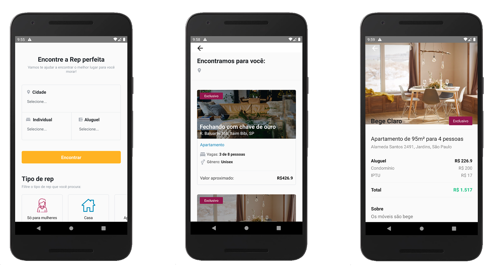

<h1 align="center">
    
</h1>

<h4 align="center">
  Reinvente seu jeito de encontrar repúblicas 
   
   🚧 Em desenvolvimento 🚧 
</h4>

  

  
  
  

  

  

  <a href="#rocket-tecnologias">Tecnologias</a>&nbsp;&nbsp;&nbsp;|&nbsp;&nbsp;&nbsp;
  <a href="#-projeto">Projeto</a>&nbsp;&nbsp;&nbsp;|&nbsp;&nbsp;&nbsp;
  <a href="#-layout">Layout</a>&nbsp;&nbsp;&nbsp;|&nbsp;&nbsp;&nbsp;
  <a href="#-como-contribuir">Como contribuir</a>&nbsp;&nbsp;&nbsp;|&nbsp;&nbsp;&nbsp;
  <a href="#memo-licença">Licença</a>

 

  

  

  

## :rocket: Tecnologias

Esse projeto foi desenvolvido com as seguintes tecnologias:

- [Node.js](https://nodejs.org/en/)
- [React](https://reactjs.org)
- [React Native](https://facebook.github.io/react-native/)
- [Expo](https://expo.io/)
- [Redux](https://redux.js.org/)

## 💻 Projeto

##### O Problema: 
Atualmente, existem dois métodos populares para procurar repúblicas, que são os conselhos de repúblicas e grupos de facebook, mas, os universitários de outras cidades e estados que necessitam de uma moradia no local do seu centro acadêmico, acabam não tendo conhecimento de tais canais de comunicação, sendo assim, acabam tendo uma grande dificuldade de conseguir uma república.

##### Solução:
O AchaRep é um projeto que visa criar um buscador de repúblicas em um único lugar, onde você consegue encontrar a rep perfeita perto da sua universidade.

## 🔖 Layout

Você pode ver o layout do projeto através [desse link](https://xd.adobe.com/view/beef8f2a-4dcb-41b6-4032-0b8c0e0ba2d2-c8de/).

## 🤔 Como contribuir

- Faça um fork desse repositório;
- Cria uma branch com a sua feature: `git checkout -b minha-feature`;
- Faça commit das suas alterações: `git commit -m 'feat: Minha nova feature'`;
- Faça push para a sua branch: `git push origin minha-feature`.

Depois que o merge da sua pull request for feito, você pode deletar a sua branch.

## :memo: Licença

Esse projeto está sob a licença MIT. Veja o arquivo [LICENSE](LICENSE.md) para mais detalhes.

---

##### Feito com ♥ by Vinnicius Gomes
